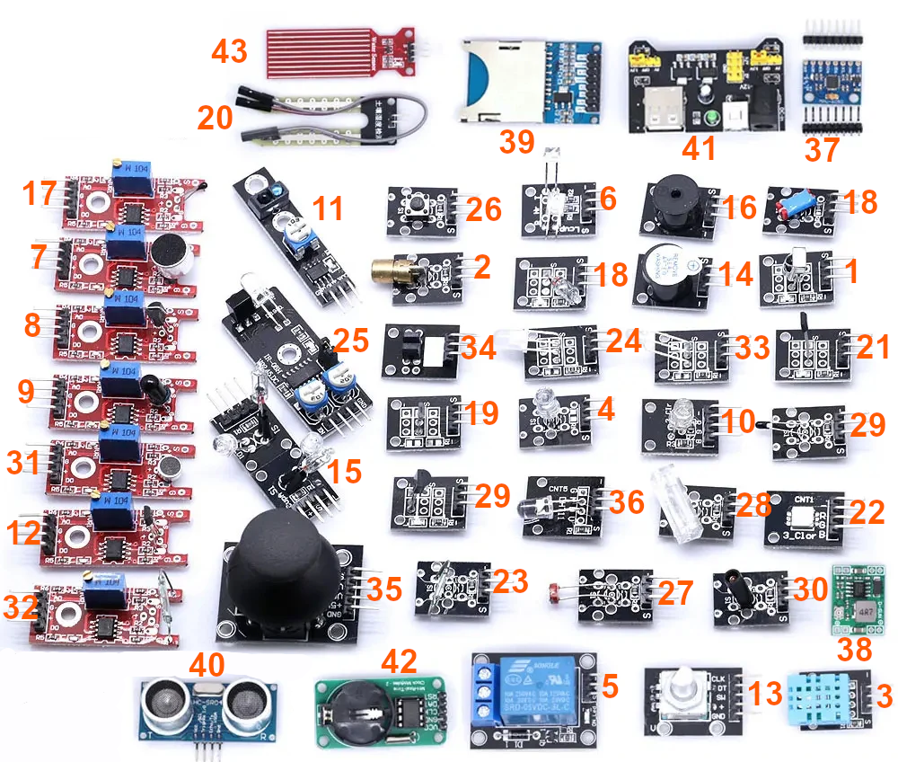

# esp32-iot-projects
## Objective
Repository created to showcase and save the programming of an assortment of sensors using ESP32 based boards.

### Boards and sensors used

**Boards:**
- NodeMCU-32S (ESP32-WROOM-32D, Type-c)
- M5Stack Atom Lite

**Sensors:**
NOTE: I only own 37 out of the 45 shown)

